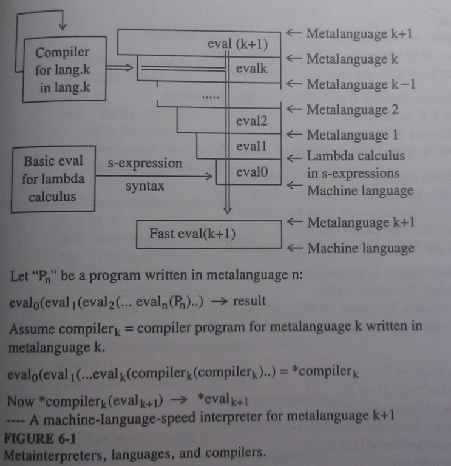

# Self - Interpretation #

&lambda; - Calculus is powerful enough to express any computable function. In
this chapter we will show, that &lambda; - Calculus is expressible as
a computable function. It is therefore possible to write an interpreter for
&lambda; - Calculus in &lambda; - Calculus.

We will write a function called ***eval***, that takes arbitrary &lambda; function
and evaluates it. Once having this ***eval*** function writen in machine
language, we can use it to write a more advanced ***eval*** on top of it, which
has more advanced features (abstract programming syntax, builtin functions, IO,
error handling etc). We can then continue and use new ***eval*** to build more
**evals** for even more powerful features. This way we can quickly implement
experimental langauges, and if the performance needs to be improved, a layer
can be reimplemented in native language. Layers above will execute faster
without the need to reimplement them.

## Abstract Interpreters ##

First interpreter interprets simple &lambda; - Calculus without any of the
*simplifications*.

syntax summary:

	<expression> := <identifier> | <function> | <application>
	<function>   := (-><identifier>'|'<expression)
	<application := (<expression><expression)

Abstract syntax functions for ***eval***:

	is-id(E)
	is-function(E)
	is-application(E)

	get-function(E)			#get function from application E
	get-argument(E)  		#get argument from application E
	get-id(E)        		#get identifier from function E
	get-body(E)      		#get body from function E

	create-function(x,E)    #create (->x|E)
	create-application(A,E) #create (AB)
	new-id()				#return a guaranteed unique identifier symbol

Abstract interpreter:

	eval(e) =				#evaluate expression e as far as we can
		if is-id(e)
		then e
		else if is-function(e) 
			 then create-function(get-id(e), eval(get-body(e)))
			 else apply(get-function(e), get-argument(e))

	apply(f,a) =			#normal order application
		if is-id(f)
		then create-application(f, eval(a))
		else if is-application(f)
			 then apply(eval(f),a)
			 else eval(subs(a, get-id(f),get-body(f)))

	apply(f,a) =			#applicative order application
		if is-id(f)
		then create-application(f, eval(a))
		else let b = eval(a) in 
				if is-application(f)
				then apply(eval(f),a)
				else eval(subs(a, get-id(f),get-body(f)))

	subs(a,x,e) =			#substitute a for x in e
		if is-id(e)
		then if e = x 
			 then a
			 else e
		else if is-application(e)
			 then create-application(subs(a,x,get-function(e)),
									 subs(a,x,get-argument))
			 else let y = get-id(e)
				  and c = get-body(e)
				  in if y = x
					 then e
					 else let z = new-id() in
							create-function(z, subs(a,x,subs(z,y,c)))

And now in human language. ***Eval*** has 3 sections, in first it leaves identifiers as
they are, in second it handles functions by by recreating them, but with their
body fully reduced. In third, it handles application by applying the function
to arguments (therefore passing it into ***apply*** function)

***Apply*** handles reduction of applications. If `f` is identifier, the only
thing that can be reduced is the argument. If `f` is application, then the
function needs to be evaluated before applied to arguments. If  `f` is
function, it is applied to the argument `a`.

