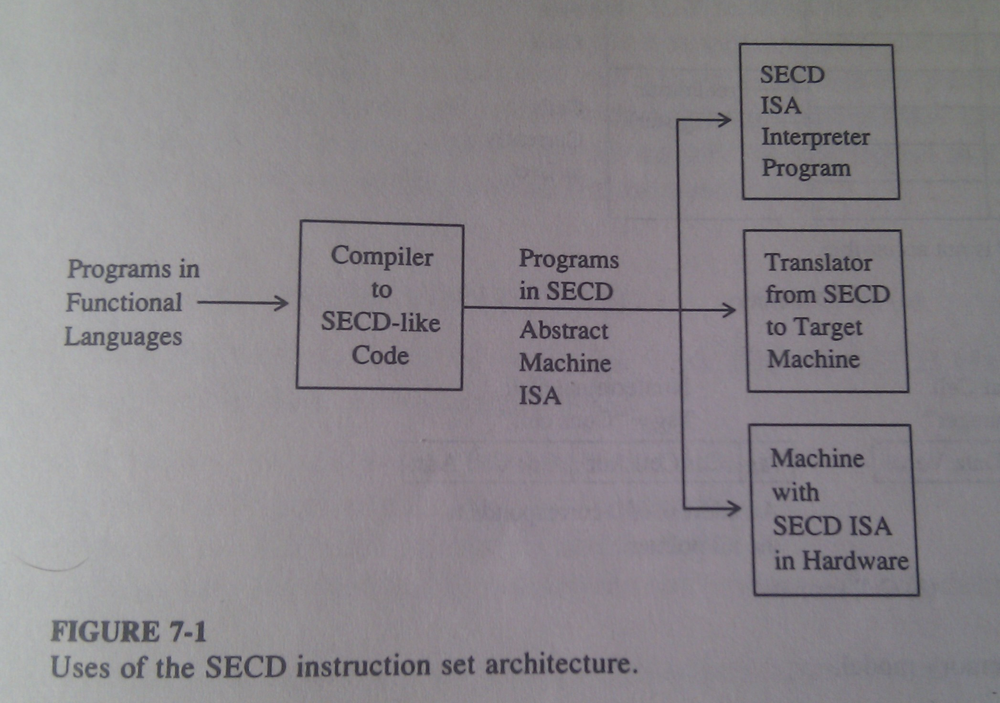
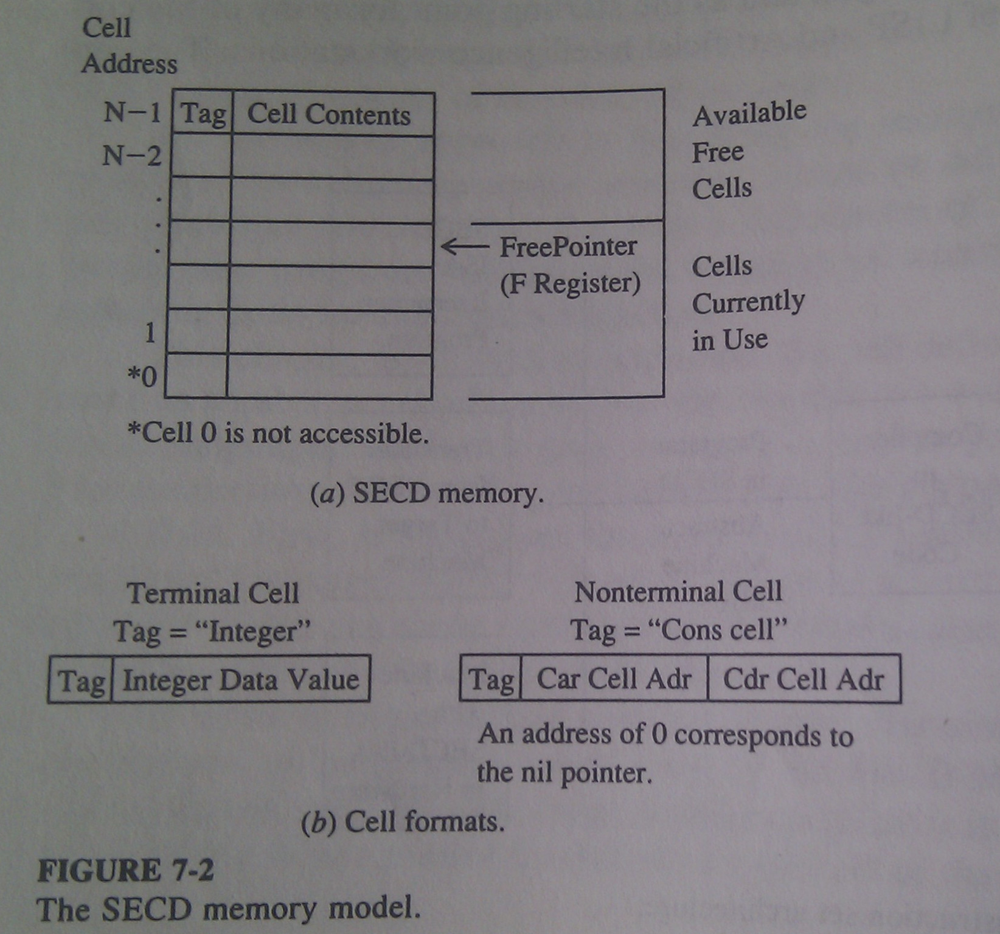
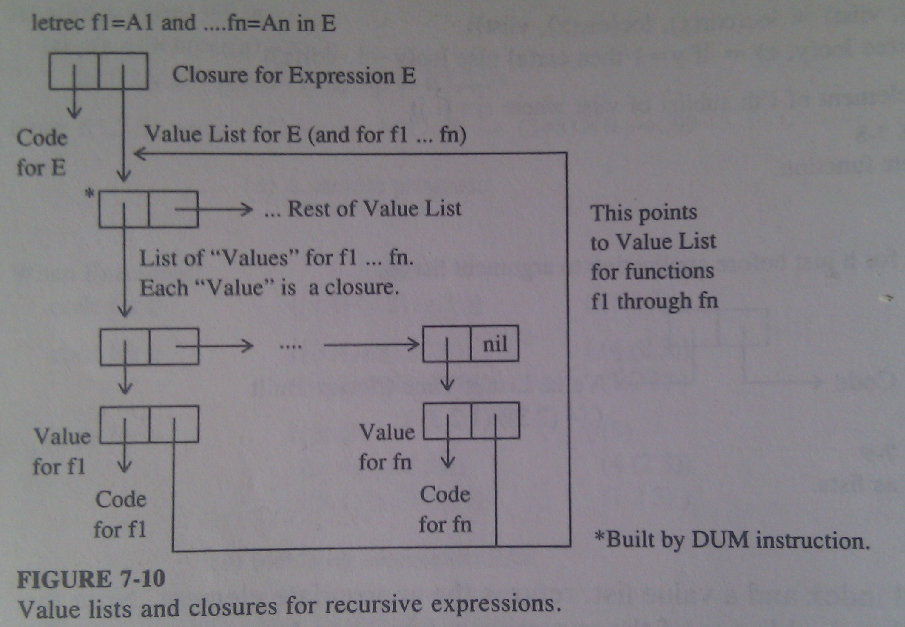
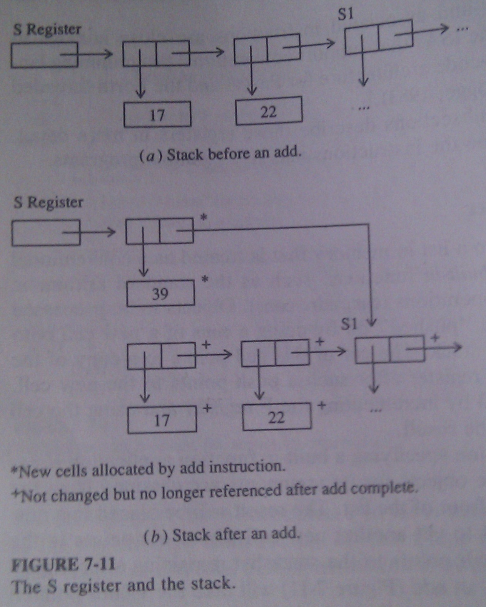
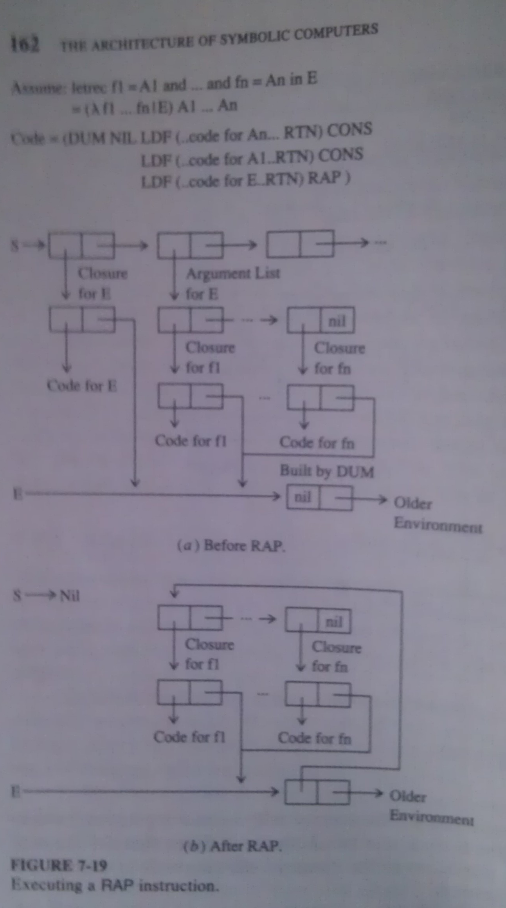

# The SECD Abstract Machine #
 
So far we have described two simple functional languages based on &lambda;
- Calculus: abstract programming and a prefix s-expression equivalent. The
operations of these languages has been described in terms of interpreters for
such languages (written in themselves) - ***denotational semantics***.

An alternative approach is through ***interpretative semantics***, where we
define a simple ***abstract machine*** and combine this with a description of
how a compiler would take programs written in the language of interest and
generate matching code for the abstract machine.

We will define ***SECD Machine*** as an abstract machine with properties which
are well suited to functional languages, and we will give a simple compiler for
the prefix s-exression.

The SECD Machine was invented by Peter Landin (1963) as a sample target for the
first function-based langauge, LISP. 

## List Memory ##

The basic SECD memory model assumes a large collection of identically formatted
***cells*** in a single memory pool. 

The ***tag*** field in each cell describes how the rest of the cell should be
interpreted. For this chapter, we assume only two types: ***integers*** and
***cons cells***. For integers, bytes after the tag represent the value, for
cons cells, the space after tag is split into two halves, the ***car field***
and ***cdr field***. Both of these fields contain pointers (addresses) to other
cells in the memory. A pointer value of 0 indicates ***nil pointer***. 

A register in the machine called ***freelist pointer*** (or ***F register***),
points to the first free cell in the memory. When a cell is allocated,
a value in the F register is incremented. Program starts with F initialized to
0. What will happen when F runs over the top of available memory will be
explained later.

## Basic Data Structures ##

There are five key kinds of data structures that the SECD Machine will build,
manipulate, and keep in memory:

* Arbitrary s-expressions for computed data
* Lists representing programs to be executed
* Stacks used by the program's instructions
* ***Value lists*** containing the arguments for uncompleted function
  applications
* Closures to represent unprocessed function applications

### Programs as Lists ###

Programs for SECD Machine are lists. Each element of the list corresponds to an
individual instruction. A call to function involves saving where are we in the
current list and starting execution at the beginning of the list associated
with the called function. 

Individual elements of a program list are of two types: simple integers or
arbitrary lists. The former are equivalend to an ***opcode*** specifying some
basic instruction in the SECD Machine's architecture. The latter usually
represent alternative branches of program flow (for example `if-then-else`)

### Stacks as Lists ###

Stacks are represented as lists, pushing on top of the stack is in fact consing
an object onto the list. Popping an element returns **caar** to get element's
value and a **cdr** to return a pointer to the rest of the list. 

A subtle but important difference between these stacks and the conventional
stacks build out of sequential memory is that whilst a pop following a push
does not overwrite the storage allocated by the element popped off. New cell is
allocated for push, and a cell holding popped value still exists after push.
There are cases when this is valuable feature, but most of the time this just
introduces garbage. Garbage collection will be addressed in future sections.

### Value Lists ###

Given that the SECD Machine supports arbitrary s-expressions, it naturally
supports association lists. The instruction set supports directly a form of
alist that includes only the value half of each pair. The SECD form is then
a list of sublists where each sublist contains the argument values (and not the
names) for a particular function call that has been made but as yet is not
complete.

A simple compiler can eliminate the need for the identifier name by building an
analog at compile time and encoding the index into the appropriate SECD Machine
instruction. Index will be in the form `(i,j)` where `i` determines which
sublist of the alist is desired, and `j` determines which element of that
sublist is needed. 

### Closures ###

To the SECD Machine a ***closure*** is the combination of the code for some
function and a value list.

### Recursive Closures ###

## The SECD Machine Registers ##

The basic instruction set architecture of the SECD Machine consists of
instructions that manipulate four main data structures found in memory:

* ***evaluation stack*** (or just simply ***stack***)
* ***environment***
* ***control list***
* ***dump***

These are accompanied by the fifth - ***F register***.

### The S Register ###

The S register is threated as a conventional evaluation stack for built-in
functions, such as `+, -, *, /` and stack operations (`car,cdr,cons`).

### The E Register ###

The ***environment register*** points to the current value list of function
arguments. This list is referenced by the machine when a value for an argument
is needed, augumented, when a new environment for a function application is
constructed, and modified when previously created closure is unpacked. 

### The C Register ###

The ***control register*** functions just like the ***program counter*** or
***instruction pointer***. It points to the memory cell that designates
through its car the current instruction to execute. When an instruction is
completed, the content of the C register is replaced by the content of the cdr
field of the last memory cell used by the current instruction `C <- cdr(C)`.

### The D Register ###

The ***dump register*** points to a list in memory called ***dump***. The
purpose of the ***dump*** is to remember the state of a function application
when a new application in that function's body is to be started. This is done
by appending onto the dump three new cells which record in their cars the
values of the S, E, and C registers before the application. When the
application completes, popping the top of the dump restores those registers to
their original values so that the original application can continue. This is
similar to ***call-return*** sequence found in conventional machines for
procedure or subprogram activation and return.

## The Basic Instruction Set ##

### Accessing Object Values ###

These instructions push values of objects onto the S stack.
* ***NIL*** pushes a nil value
* ***LDC*** pushes a *constant*. The constant is found as the next element on
  the C list after the instruction (the **card** of the C list).
* ***LD*** loads an element from current environment. The **cadr** of the
  C list is a cell of the form `(i,j)`.

### Built-in Function Applications  ###

These instructions handle build-in functions such as **car, cdr, cons, atom,
add, sub** ... Proper number of arguments is popped from the S stack and
the result is pushed on the S stack.

### Instructions for if-then-else ###

***SEL*** instruction assumes that the top of the S is an integer either zero
or nonzero. Following the ***SEL*** is the C list are two elements (**cadr**
and **caddr** of the C list) both of which are lists of instructions. The last
instruction in both lists is ***JOIN***. When executed, the ***SEL*** will push
onto the D a pointer to the C list just beyond the second sublist (**cdddr** of
the C).  The machine will then pop the S stack, test it, and replace C with
**cadr** or **caddr** depending if the value was zero. The ***JOIN*** then
resumes the original program by popping the top off the D and resetting C to
point to it.  

### Nonrecursive Program-Defined Functions ###

***LDF*** (load function) is followed in the C list by an element pointing to
a sublist containing the code representing some program-defined function. The
last instruction of this subprogram list is ***RTN*** which functions similarly
to ***JOIN***. 

When ***LDF*** is executed, it builds in a new cell a closure consisting of
a pointer to the new function's code and a copy of the current E register. The
closure is pushed on the S stack.

The closure is executed by ***AP*** (apply) instruction. Top of the S stack
should contain a closure, and underneath it a list representing the argument
values to be applied to the function. Executing the ***AP*** causes the
**cddr** of S, the E, and the **cdr** of C to be pushed onto the dump. After
this, the S register is set to nil, the C register is set to the beginning of
the code specified by the closure, and the E register is set to the cons of the
arguments (second element of the original S list) and the environment from
closure (cdr of the closure cell).

***RTN*** takes the top of the S as the value to return from the application.
This value is consed to the old S from the dump, S register is set to point to
this list. The E and C registers are restored directly from the dump and the
calling function is restored. 

### Recursive Program-Defined Functions ###

The ***DUM*** instruction conses onto the E list a new cell whose car is nil.
This corresponds to a new argument list tat is initially empty (a dummy list).
This will eventually be a pointer to the self-looping value list.

A ***DUM*** instruction is used just before the ***LDF*** instruction to build
a recursive closure. This will make the environments stored in those closures
point to a value list where the first element is this current *dummy* sublist.

The ***RAP*** (recursive apply) assumes that the top of the S stack looks like
that for an ***AP*** (a closure representing a function to be executed, and an
argument list). In this case the function in the closure is the expression that
calls the recursively defined functions. The closure's environment is a pointer
to the same list indicated by the current E register. This, in turn, should be
a list where the first element was that built by the ***DUM***. Furthermore,
the list of argument values should be a list of closures, one per recursively
defined function, where the environments of these closures are also pointer to
the same dummy cell. 

Execution of the ***RAP*** is identical to the ***AP*** except that the car of
the cell pointed to by E (the dummy cell) is reset to point to the second
argument of the S stack (the list of closures). Given that the closures in that
argument also point to the dummy cell, the result is exactly the loop of
pointers desired. 

Within the code called by the ***RAP***, any required calls to the i-th
recursively defined function **fi** are initiated by a ***LD(1,i)*** followed
by the ***AP***. The ***LD*** fetches the closure for the function from the
environment, and ***AP*** unpacks it as before. The environment established by
the closure is the same environment it came from, with the exception that the
***AP*** adds a list to the front representing the arguments to the function.
Thus, a ***LD(2,i)*** from inside the code for the function **fi** will
retrieve an identical copy of its closure, and another ***AP*** will thus start
a recursive call to **fi** properly. 

Again, a ***RTN*** at the end of the expression unstacks the original S, E, and
C values stacked by the ***RAP*** function(s).

### Machine Control Instructions ###

* ***STOP*** stops the machine in its tracks.
* ***READC*** and ***WRITEC*** perform simple input/output operations.

## Compiling Simple S-Expressions ##

`*<expr>` stands for SECD code compiled from the s-expression `<expr>`.
`AB` stands for the result of appending list `B` to list `A` as in `(1 2)(3 4)
= (1 2 3 4)`

The function ***compile*** has three arguments, the expression `e` being
compiled, a namelist `n`, and an accumulating parameter `c`. The namelist
represents the variables that would be available in the environment when the
s-expression `e` is executed. The accumulating parameter represents already
generated code. Initial call to compile an expression `e` would be:

	compile(e, nil, (STOP))

Code sequences for s-expressions:

	Syntax:  <number>
	Code:    (LDC <number>)

	Syntax:  nil
	Code:    (NIL)

	Syntax:  <identifier>
	Code:    (LD (i,j))

	Syntax:  (<builtin> <expr1> ... <exprn>)
	Code:    (*<exprn> ... *<expr1> <builtin>)
	Example: (mpy (add x 1) 256) =>
			 (LDC 256 LDC 1 LD (1.1) ADD MPY)
			

	Syntax:  (if <expr1> <expr2> <expr3>)
	Code:    *<expr1> SEL (*<expr2> JOIN) (*<expr3> JOIN) *<expr2>
	Example: (if (null x) 1 (car x)) =>
			 (LD (1.1) NULL SEL (LDC 1 JOIN) (LD (1.1) CAR JOIN))

	Syntax:  (lambda (<id1> ... <idn>) <expr>)
	Code:    (LDF (*<expr> RTN))
	Example: (lambda (x y) (add x y)) =>
			 (LDF (LD (1.2) LD (1.1) ADD RTN))

	Syntax:  (let (<id1> ... <idn>) (<expr1> ... <exprn>) <expr>)
	Code:    (NIL *<exprn> CONS ... *<expr1> CONS LDF *<expr> RTN AP)
	Example: (let (x y) (1 2) (+ x y)) =>
			 (NIL LDC 2 CONS LDC 1 CONS LDF (LD (1.2) LD (1.1) ADD RTN) AP)
			 
	Syntax:  (letrec (<id1> ... <idn>) (<expr1> ... <exprn>) <expr>)
	Code:    (DUM NIL *<exprn> CONS ... <expr1> CONS LDF (*<expr> RTN RAP))
	Example: (letrec (f) 
					 ((lambda (x m) 
						(if (null x) 
							m
							(f (cdr x) (+ m 1))))) 
					 (f (1 2 3) 0)) =>
			 (DUM NIL LDF (LD (1.1) SEL 
				(LD (1.2) JOIN) 
				(NIL LDC 1 LD (1.2) ADD 
					CONS LD (1.1) CDR 
					CONS LD (2.1) AP JOIN) RTN)
			 CONS LDF (NIL LDC 0 CONS LDC (1 2 3) CONS LD (1.1) AP RTN) RAP)

You still there? Ok, let's continue.

A compiler from s-expressions to SECD code:

	compile(e,n,c) =
		if atom(e)
		then #a nil, number, or identifier
			if null(e)
			then cons(NIL, c)
			else let ij = index(e, n) 
				 in if null(ej)
				 then cons(LDC, cons(e, c))
				 else cons(LD, cons(ij, c))
		else let fcn = car(e)
			 and args = cdr(e)
			 in if atom(fcn)
				then #a builtin, lambda or special form
					if member(fcn, builtins)
					then compile-builtin(args, n, cons(fcn, c))
					elseif fcn = LAMBDA
					then compile-lambda(cadr(args), cons(car(args), n), c)
					elseif fcn = IF
					then compile-if(car(args), cadr(args), caddr(args), n, c)
					elseif fcn = LET or fcn = LETREC
					then let newn = cons(car(args), n)
						 and values = cadr(args)
						 and body = caddr(args)
						 in if fcn = let
							then cons(NIL, 
									  compile-app(values, n,
										  compile-lambda(body, newn, cons(AP, c))))
							else #letrec
								append((DUM NIL),
									compile-app(values, 
										newn,
										compile-lambda(body, newn, cons(RAP,
										c))))
					else #fcn must be a variable
						cons(NIL, 
							 compile-app(args, n, cons(
								LD, cons(index(fcn,n), cons(AP, c)))))
				else #an application with nested function
					cons(NIL, compile-app(
						args, n, compile(fcn, n, cons(AP, c))))

You still there? Seriously??

Auxiliary functions:

	compile-builtin(args, n, c) =
		if null(args)
		then c
		else compile-builtin(cdr(args), n, compile(car(args), n, c))

	compile-if(test, then, else, n, c) =
		compile(test, n, cons(SEL, cons(compile(then, n, cons(JOIN, nil)),
						 cons(compile(else, n, cons(JOIN, nil)), c))))

	compile-lambda(body, n, c) =
		cons(LDF, cons(compile(body, n, cons(RTN, nil)), c))

	compile-app(args, n, c) =
		if null(args)
		then c
		else compile-app(cdr(args), n,
					compile(car(args), n, cons(CONS, c)))

	index(e,n) = index(e, n, 1)

	index(e, n, i) = 
		if null(n) then nil
		else letrec indx2(e, n, j) =
						if null(n) then nil
						elseif car(n) = e then j
						else indx2(e, cdr(n), j + 1)
			 in let j = indx2(e, car(n), 1)
				in if null(j)
				then index(e, cdr(n), i + 1)
				else cons(i, j)

### Built-in Function Applications ###

The code generated for the application of ***built-in*** functions consists of
the sequences of SECD code needed for each argument appended to the SECD
instruction that performs the function.

### Conditional Forms ###

The code consist of the instructions that evaluates the test expression,
followed by ***SEL*** and two lists which correspond to *then* and *else*
expressions. Both sublists end with ***JOIN***.

### Lambda Function Definitions ###

The code compiled for ***lambda*** expression consists of a two element list,
***LDF*** instruction and the list consisting of the compiled form of the
lambda expression's body terminated by a ***RTN***.

Executing such code sequence will push onto S a closure whose code pointer is
pointing to the sublist following the ***LDF*** and whose embedded environment
is the cell pointed to by E when the ***LDF*** is executed. When
***compile-lambda*** is called, namelist already contains lambda arguments.

### Combined Function Definitions and Applications ###

`Let` and `letrec` expressions correspond to evaluating a series of
expressions, associating them with identifiers, and then evaluating a new
expression that references these identifiers. The compiled code must compute
each of these expressions and then **cons** the results together into a list
that can be passed as an argument to the lambda function implied by the `in`
expression.

All `let` expressions are pushed onto S - these will serve as arguments to the
lambda function, which is pushed next. Body of the lambda is made by `in`
expression and terminated by ***RTN***. 

For the `let` expression, the final instruction compiled is an ***AP***. When
executed, this instruction unpacks the closure, and starts the body, with
computed values estabilished on the top of E.

The only difference for a `letrec` is that a ***RAP*** is used instead, and
there is an extra instruction to begin the sequence, ***DUM***. 

## Sample Compilation ##

Original abstract program to compile:

	let x = 3 and one = 1 in
		letrec fact(n, m) =
			if (eq n 0) then m
			else fact(n - one, n * m)
		in fact(x, one)

As s-expression:

	(let (x one) (3 1)
		(letrec (fact) 
				((lambda (n m) (if (= n 0)
								   m 
								   (fact (- n one) (* n m)))))
				(fact x one)))

And the compilation process:

	compile((let...), nil, (STOP))

Step 1:

	(NIL.compile-app((3 1), nil, 
		compile-lambda((letrec...), ((x one)), (AP STOP))))

Step 2:
	
	(NIL.compile-app((3 1), nil,
		(LDF.(compile((letrec...), ((x one)), (RTN)), (AP STOP)))))

Step 3:

	(NIL.compile-app((3 1), nil,
		(LDF (DUM NIL.compile-app(((lambda ...)), 
								  ((fact) (x one)),
								  compile-lambda((fact x one), 
												 ((fact) (x one)),
												 (RAP RTN))
								  (AP STOP))))))

Step 4:

	compile-lambda((fact x one), ((fact) (x one)), (RAP RTN))

	=

	(LDF (NIL LD (2.2) CONS LD (2.1) CONS LD (1.1) AP RTN) RAP RTN)

	=

	(AAAAA)

Step 5:

	(NIL.compile-app((3 1), nil,
		(LDF (DUM NIL.compile-app(((lambda ...)), 
								  ((fact) (x one)),
								  (AAAAA))
			(AP STOP))))))

Step 6:

	compile-app(((lambda ...)), ((fact) (x one)), (AAAAA))

	=

	compile-app((), ((fact) (x one)), 
		compile((lambda...), ((fact) (x one)), (CONS AAAAA)))

	=

	compile((lambda...), ((fact) (x one)), (CONS AAAAA))

	=

	(LDF.(compile((if...), ((m n) (fact) (x one)), (RTN)).(CONS AAAAA)))

	=
		((m n) (fact) (x one)) => nmfactxone
	(LDF.(compile((= n 0), nmfactxone, 
		cons(SEL, 
			cons(compile((then), nmfactxone, (JOIN)), 
				cons(compile((else), nmfactxone, (JOIN)), (RTN))))).(CONS
				AAAAA)))

Step 7:

	compile((then), nmfactxone, (JOIN))

	=

	compile(m, nmfactxone, (JOIN))

	= (LD (1.1) JOIN) => THEN

Step 8:

	compile((else), nmfactxone, (JOIN))

	=

	compile((fact ...), nmfactxone, (JOIN))

	=

	cons(NIL, compile-app(((- n one) (* n m)), nmfactxone,
		cons(LD, cons((2.1), cons(AP JOIN)))))

	=
	
	cons(NIL, compile-app(((- n one) (* n m)), nmfactxone,
		(LD (2.1) AP JOIN)))

	= 

	(NIL LD (1.2) LD (1.1) MPY CONS 
		LD (1.2) LD (3.2) SUB CONS
			LD (2.1) AP JOIN) => ELSE

Step 9:

	(LDF (NIL LDC 0 CONS LD (1.1) EQ SEL THEN ELSE RTN) CONS AAAAA) =>
	(BBBBB)

Step 10:

	(NIL.compile-app((3 1), nil,
		(LDF.(DUM NIL.BBBBB.(AP STOP)))))

Step 11:

	(NIL.compile-app((3 1), nil,
		(LDF (DUM NIL BBBBB) AP STOP)))

Step 12:

	(LDF (DUM NIL BBBBB) AP STOP) => (CCCCC)

	(NIL.compile-app((), nil
		compile((3 1), nil, CCCCC)))

	=

	(NIL.compile-app((1), nil,
		(LDC 3 CONS CCCCC)))

	=

	(NIL.compile-app((), nil
		(LDC 1 CONS LDC 3 CONS CCCCC)))

	= (NIL LDC 1 CONS LDC 3 CONS CCCCC)

Step 13:

	(NIL LDC 1 CONS LDC 3 CONS LDF
		(DUM NIL LDF
			(NIL LDC 0 CONS LD (1.1) EQ SEL 
				(LD (1.1) JOIN)
				(NIL LD (1.2) LD (1.1) MPY CONS
					LD (1.2) LD (3.2) SUB CONS
					LD (2.1) AP JOIN)
				RTN) 
		CONS LDF
			(NIL LD (2.2) CONS LD (2.1) CONS LD (1.1) AP RTN) 
		RAP RTN)
	AP STOP)

## The Funarg Problem ##

If we try to implement SECD Machine on conventional stacks (which are much more
performant), all kinds of strange results can occur, when dealing with
closures. This goes by the name ***funard problem***. On conventional stack,
popping the value and then pushing other value just overwrites the memory area,
it does not allocate more more space.

***Funarg problem*** can occur whenever a function which produces result
contains ***free variables***. 

Solutions are to use linked lists, separate heaps for storing environments,
duplicate environment stacks, spaghetti stacks or cactus stacks, or doing
explicit code copying and substituting argument values.
	
## Optimizations ##

***Tail recursion*** occurs when the last thing a function does is call some
other function. Instructions generated by the compiler are `(... AP RTN)`. When
executed, `AP` pushes values for S, E, and C onto D. The `RTN` of the called
function will pop these values, only to be replaced by the `RTN` in the current
function. 

An extension to the SECD architecture is needed - `DAP` (***direct apply***)
instruction. The instruction performs only the environment modification and
does not push values onto D. Sequence `(... AP RTN)` would be replaced by `(...
DAP)`.

Now very common sequence is:

	(... LDF (...code... RTN) DAP)

A closure is created just to be taken apart by `DAP`. We introduce a new
instruction - `AA` (***Add Arguments***) with following register transition:

	AA: (v.s) e (AA.c) d => s (v.e) c d

And the above sequence could be replaced by:

	(... AA ...code... RTN

When the called function does not need reference to the current arguments,
a new arguments does not have to be consed on E, the existing cells could be
reused. A new instruction is to be added - `TRAP` (***Tail-Recursive Apply***),

	TRAP: ((f.(e'.e''))v.s) e (TRAP c) d => NIL (v.e'') f d

or even better:

	TRAP: ((f.e') v.s) e (TRAP c) d => NIL rplaca(e', v) f d

As before, ***rplaca*** replaces the car subfield. Now the compiler must verify
that the arguments are not used, and there is one very common case when this is
true - ***self-recursion***, where there is no way how to use old arguments.
Further optimization along the lines of `AA` would be `MA` (***Modify
Arguments***):

	MA: (v.s) e (MA.c) d => rplaca(e,v) c d

This instruction replaces the first element of the current environment by the
argument list currently on the top of the S.

## Examples ##

1. Generate the SECD code for the following:
	1. `(let (x y) (1 2) (* x y))`
	2. `let f = (let y = 4 in (->x| y * x)) in f(3)`
	3. `letrec f=(->n | if n then 1 else f(n - 1) + f(n - 2)) in f(3)`
	4. The towers of Hanoi

	Compilation of `(let (x y) (1 2) (* x y))`:

		(NIL *2 CONS *1 CONS LDF (LD (1.2) LD (1.1) MUL RTN) AP) ->
		(NIL LDC 2 CONS LDC 1 CONS LDF (LD (1.2) LD (1.1) MUL RTN) AP)

	Compilation of `let f = (let y = 4 in (->x| y * x)) in f(3)`:

		*(LET (F) ((LET (Y) (4) (lambda (x) (* y x)))) (f 3)) ->
		(NIL *(LET (Y) (4) (lambda (x) (* y x))) CONS LDF (LDC 3 CONS LD(1.1) AP RTN) AP)->

		*(LET (Y) (4) (lambda (x) (* y x))) ->
		(NIL LDC 4 CONS LDF (*(lambda (x) (* y x)) RTN) AP)

		*(lambda (x) (* y x)) ->
		(LDF (LD (1.1) LD (2.1) MUL) RTN)

		------>
		(NIL NIL LDC 4 CONS LDF (LDF (LD (1.1) LD (2.1) MUL) RTN) AP CONS LDF (LDC 3 CONS LD(1.1) AP RTN) AP)

	Compilation of `letrec f=(->n | if n then 1 else f(n - 1) + f(n - 2)) in f(3)`:

		->
		*(LETREC (f) (LAMBDA (n) (IF n 1 (+ (f (- n 1)) (f (- n 2))))) (f 3)) ->
		(DUM NIL *(LAMBDA (n) (IF n 1 (+ (f (- n 1)) (f (- n 2)))) RTN) 
			 CONS LDF (LDC 3 CONS LD(1.1) AP RTN) RAP)
	
		*(LAMBDA (n) (IF n 1 (+ (f (- n 1)) (f (- n 2)))) RTN) ->
		(LDF (*(IF n 1 (+ (f (- n 1)) (f (- n 2)))) RTN))

		*(IF n 1 (+ (f (- n 1)) (f (- n 2)))) ->
		(LD (1.1) SEL (LDC 1) *(+ (f (- n 1)) (f (- n 2))))

		*(+ (f (- n 1)) (f (- n 2))) ->
		(NIL LDC 2 LD (1.1) SUB CONS LDF (LD (2.1) RTN) AP 
		    NIL LDC 1 LD (1.1) SUB CONS LDF (LD (2.1) RTN) AP ADD)

		------->
		(DUM NIL LDF (LD (1.1) SEL 
							   (LDC 1) 
							   (NIL LDC 2 LD (1.1) SUB CONS LDF (LD (2.1) RTN) AP 
								NIL LDC 1 LD (1.1) SUB CONS LDF (LD (2.1) RTN) AP ADD)
					  RTN) 
			 CONS LDF (LDC 3 CONS LD(2.1) AP RTN) RAP)

	Tower of Hanoi:

		toh(n) = (lambda (n) 
					(let (l r m b) 
						 (n 0 0 nil)
						 (letrec (h) 
								 (lambda (n f t o b) 
										 (if (eq n 1)
											 (append (cons f t) b)
											 (h (- n 1) 
												o 
												t 
												f 
												(append (cons f t) 
														(h (- n 1)
														   f
														   o
														   t
														   b)))))
								 (h n l r m b)))) ->
		(LDF (*AAAAA RTN) RTN)
			where AAAAA = 
					(let (l r m b) 
						 (n 0 0 nil)
						 (letrec (h) 
								 (lambda (n f t o b) 
										 (if (eq n 1)
											 (append (cons f t) b)
											 (h (- n 1) 
												o 
												t 
												f 
												(append (cons f t) 
														(h (- n 1)
														   f
														   o
														   t
														   b)))))
								 (h n l r m b))) ->
		*AAAAA ->
		(NIL NIL CONS LDC 0 CONS LDC 0 CONS LD (1.1) CONS LDF (*BBBBB RTN) AP)
			where BBBBB = (letrec (h) 
								 (lambda (n f t o b) 
										 (if (eq n 1)
											 (append (cons f t) b)
											 (h (- n 1) 
												o 
												t 
												f 
												(append (cons f t) 
														(h (- n 1)
														   f
														   o
														   t
														   b)))))
								 (h n l r m b))

		*BBBBB ->
		(DUM NIL *CCCCC CONS LDF (LD (2.4) CONS LD (2.3) CONS LD (2.2) CONS
			LD (2.1) CONS LD AP))
			where CCCCC = (lambda (n f t o b) 
							 (if (eq n 1)
								 (append (cons f t) b)
								 (h (- n 1) 
									o 
									t 
									f 
									(append (cons f t) 
											(h (- n 1)
											   f
											   o
											   t
											   b)))))

		*CCCCC ->
		(LDF (*DDDDD RTN))
			where DDDDD = (if (eq n 1)
								 (append (cons f t) b)
								 (h (- n 1) 
									o 
									t 
									f 
									(append (cons f t) 
											(h (- n 1)
											   f
											   o
											   t
											   b))))

		*DDDDD ->
		(LDC 1 LD (1.1) EQ SEL 
			(LD (1.5) ld (1.3) LD (1.2) CONS APPEND)
			(LD (1.5) CONS LD (1.3) CONS LD (1.4) CONS LD (1.2) CONS LDC 1 LD
				(1.1) SUB CONS LD (2.1) AP CONS LD (1.2) CONS LD (1.3) CONS 
					LD (1.4) CONS LDC 1 LD (1.1) SUB CONS LD (2.1) AP))

		-------->
		(LDF (NIL NIL CONS LDC 0 CONS LDC 0 CONS LD (1.1) CONS 
				LDF (DUM NIL 
					LDF (LDC 1 LD (1.1) EQ SEL 
										   (LD (1.5) ld (1.3) LD (1.2) CONS APPEND JOIN)
										   (LD (1.5) CONS LD (1.3) CONS LD (1.4) CONS 
										    LD (1.2) CONS LDC 1 LD (1.1) SUB CONS 
											LD (2.1) AP CONS LD (1.2) CONS LD (1.3) CONS 
											LD (1.4) CONS LDC 1 LD (1.1) SUB CONS 
											LD (2.1) AP JOIN) 
					     RTN) CONS 
					LDF (LD (2.4) CONS LD (2.3) CONS LD (2.2) CONS
						 LD (2.1) CONS LD AP) 
				     RAP RTN) AP
			  RTN) RTN)

	Hopefully...

2. If one were to implement the SECD memory model out of a conventional memory
   with 32-bit words, how many bits could be allocated to integers, and how big
   could the memory be (in cells) if:
	* one memory word was one cell = `31 bits for integers, 15 bits for address`
	* two memory words made up one cell = `63 bits for integers, 31 bits for address`

3. Write an SECD program for:

		append(x,y) = if atom(x)
					  then y
					  else car(x).append(cdr(x),y)

		(LETREC (a) (lambda (x y) (if (atom x)
									  y
									  (cons (car x) (a (cdr x) y))))
					a)

	1. How many new memory cells are used during the compilation of `append((1
	   2), (3 4))`? = `2`
	2. If you had 100 000 cells available, how big a list could you append to
	   (3 4)? = `99998 if not counting those 2 used by (3 4)`

			 

