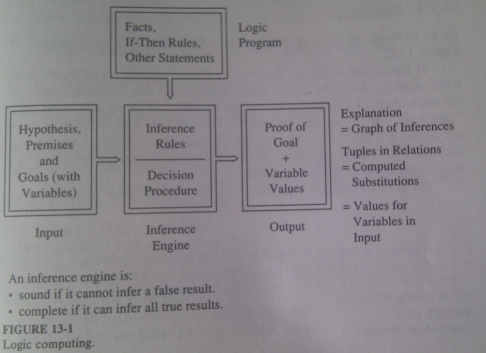

# A Logic Overview #

The primary kind of statement with which logic computing deals is a ***fact***.
A ***fact*** is an expression that some object or set of objects satisfies some
specific relationship.

## Formal Logic Systems ##

The ***sytax*** of a logic model revolves around ***logical expressions***
built up from a set of more basic ***symbols***. A subset of symbol strings
representing valid expressions is called ***well-formed formulas*** (or
***wffs***). Individually, they are called ***statement, proposition,*** or
***sentence***.

Typisal syntaxes include allowances for:

* ***constants*** (specific objects)
* ***functions*** applied to such objects to yield other objects
* ***predicates*** to test membership of tuples of objects in relations
* ***identifiers*** or ***logic variables*** stand for *unknown* objects
* other operations which combine these or place constraints on values that
  various variables may take on.

The ultimate purpose of a system of logic is to divide the universe of wffs
into pieces; those to be considered true, those that are false, and those about
which no absolute statement can be made.

In most real logic programming languages the user provides ***axioms***, rules
that are considered true. 

## Rules of Inference ##

Axiom specification provides only part of the information needed. In a properly
written program, other parts of the language's semantics extend these
statements to cover other statemenets which fully define the true and false
sides of the wff set. This extension is done via ***inferencing***, which uses
specific patterns of known sets of wffs to predict or deduce the veracity of
other wffs. Each such pattern is called an ***interence rule***. 

The actual process of inferencing involves finding some inference rule `R`,
some subset `X` of wffs already in the true set, and some other wff `a`
such that `X + a = R`. Given our definition of `R` as a set of wffs, this means
that the wff `a` should also be considered true. We say that `a` is an
***inference, logical consequence, conclusion*** or ***direct consequence***
from the set `X` using the inference rule `R`. 

Common inference rule is ***modus ponens***. This rule takes some wff `A` and
some other wff of the form `if A then B`, and infers that the wff `B` is also
true:

	modus-ponens={(A, 'if A then B', B)|A and B any valid wffs}

A ***proof*** is sequence of wffs `a1...an` such taht eack `ak` is either an
axiom or direct consequence of some subset of the prior `aj`.

A ***theorem*** is a wff `a` which is a member of some proof sequence, usually
as the last wff. The notation `Γ⊢ a` indicates that `a` is a theorem in the
system of logic under discussion (with Γ standing for the input set of axioms
specified by the logic program).

## Properties of Inference Rules ##

A set of inference rules which does not infer a theorem which is not in the
overall true set, is called ***sound***. On the other hand, we want the
inference rules to permit proofs for all true wffs that are derivable from te
axioms - such set is called ***complete***.

Slight variations of the theorem concept will also be of interest, for example
to find out if some wff would be true if we added some set of wffs. These are
called ***hypothesis, premissses***. If a proof sequence exists which includes
members of hypotheses  as axioms, then this sequence is called ***deduction***
and is noted `Γ, Y⊢ a`. It is roughly equivalent to `Γ⊢ (if Y then a)`

A ***consistent*** set of wffs does not permit derivation of contradiction. In
most cases this is important property of an axiom set and one the logic
programmer must strive to achieve.

## Decision Procedures ##

Finding inferences and proof sequences is an important part of logic-based
computing. The programmer specifies a set of axioms and then asks questions
about other wffs and their validity. The system will then try various
combinations of inference rules in an attempt to find a proof sequence. We
would like some guarantees that the questions we ask are answerable in finite
time. We also expect that the search will be more efficient than trying all
possible combinations technique, which is called ***exhaustive search*** or
***British Museum search***.

There are systems which are ***undecidable***, there is no algorithmic approach
for determining whether a particular wff is true or false. 

## Interpretations ##

Another key part of the semantics of a logic expression is the specification of
an ***interpretation*** that maps a meaning to each symbol. This starts with
a ***domain*** that defines the set of possible values or objects to be dealt
with. Functions are assigned definitions (mappings) from some domains to
others.  Symbols used as predicates map into tests on relations over these
domains. 

The key point here is that there is often an infinite number of interpretations
and combinations of interpretations which can be given the symbols used in wff
or set of wffs. The prime definition is that a wff is ***true under an
interpretation*** if the result of ***evaluating*** the wff under the
interpretation is true. The specified interpretation ***satisfies*** the wff.

We say that two wffs are ***equivalent*** if they evaluate to the same
true/false values for every possible interpretations.

## The Deduction Theorem ##

The above definitions lead to a very important result called the ***deductioin
theorem***, which will drive many of the inference engines. 

The wff `G` is a logical consequence of the wffs `A1...An` if and only if the
wff:

	if (A1 ∧ A2 ... ∧ An) then G

is valid (i.e. a tautology). 

The second form of the theorem states that the wff `G` is a logical
consequence of the wffs `A1...An` if and only if the wff

	A1 ∧ A2 ... ∧ An ∧ ¬ G

is unsatisfiable.
