# The Warren Abstract Machine #

WAM is to logical programming what SECD is to functional. Basic semantic model
of how a program carries on computation. WAM serves as the basis for most
high-performance implementations of ***Prolog*** and similar langauges. This
includes use of intermediate language for a compiler from Prolog to
conventional machines, as the basis for entirely new computer architectures
that support Prolog features directly, and as a starting point for
implementations of non-Prolog logic languages. Origins come from David H. D.
Warren's Ph.D. thesis (1977).

The general model of execution assumes that the argument registers mentioned
above contain the actual arguments for the current goal literal, and these
values are successively unified against the formal argument expression. When
a match occurs, new argument values are built for the first literal in that
clause's body, and the process is repeated for that goal. Success in solving
that goal causes code to be executed that builds the arguments for the next
goal on the right hand side. A linking mechanism keeps track of which literals
are left to be treated as goals, and in what order, after the current goal is
proven successfully. Saving copies of the argument and other registers in
a memory stack permits failure and backtracking operations to restart with
a previous goal as required. 

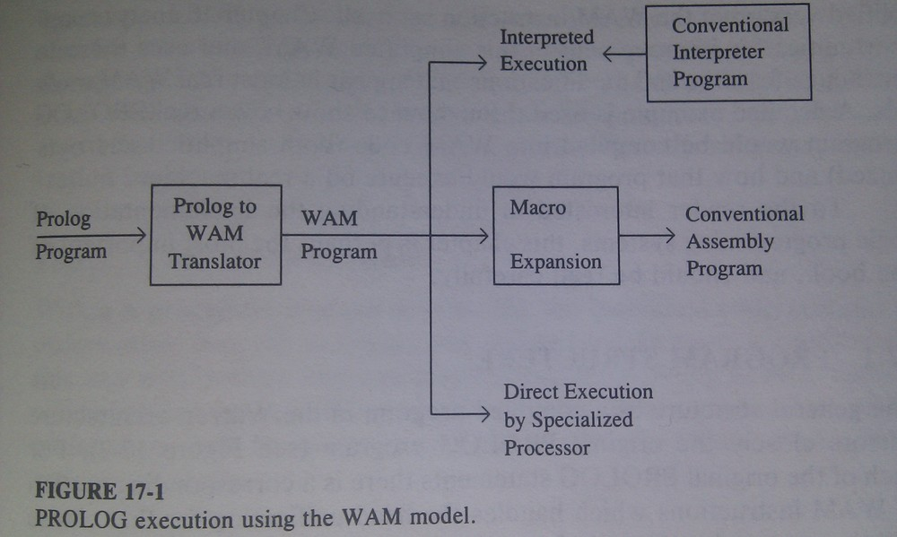

## Program Structure ##

For each of original Prolog statements there is a corresponding section of WAM
instructions which handles the head unification for that clause and the
sequencing through goals called our on the statement's right hand side.

All such code sections for clauses aving the same predicate name in their head
literal are chained directly together in the order in which the programmer
entered the original text. The chaining is via instructions at the beginning of
each section. This permits the computer to rapidly find the next clause to try
if one clause fails.

Together, each linkage of sections acts as a single ***procedure***, tailored
specifically to handle any goal whose predicate symbol matches that for its
internal clauses. The internals of the precedure step through the appropriate
statements in the expected Prolog order, with calls to other such prcedures as
needed as goals are processed. All such calls are to the entry code of
a procedure segment where the neccessary initialization is performed. 

### Code for One Clause ###

WIthin a procedure it is possible to link the individual code sections in
orders other than the simplistic way shown here. In many cases this can improve
performance by avoiding entirely clauses which are known beforehand not to work
for certain goals.

### An Individual Code Section ###

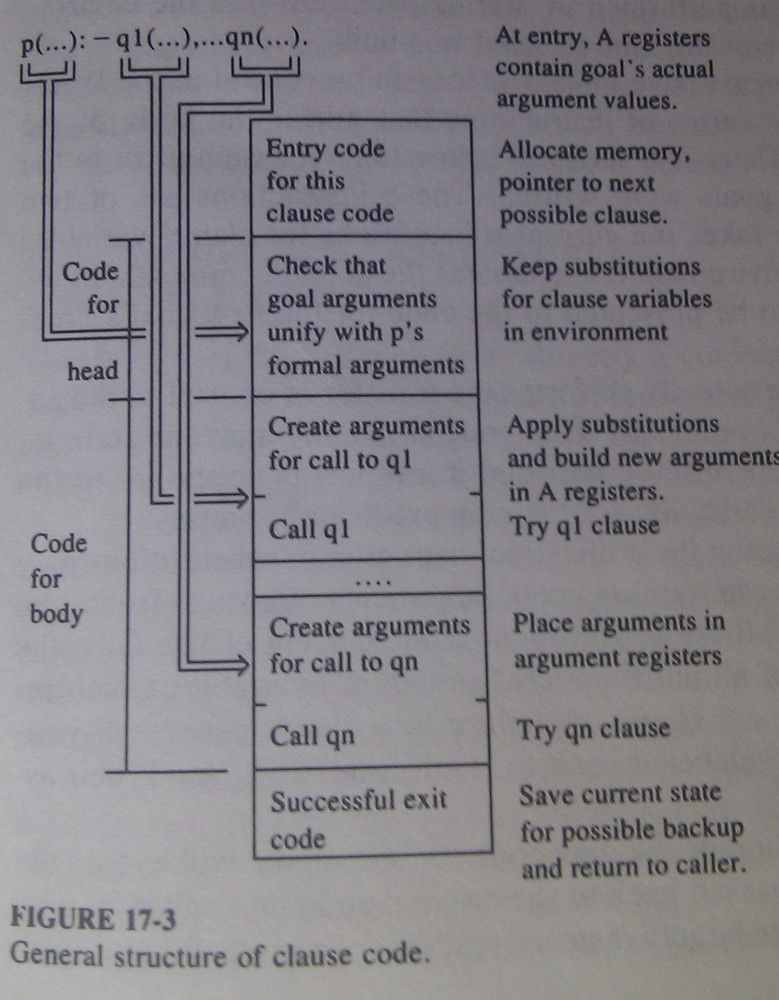

Starting out the segment is initialization code which sets up the machine's
major data structures to permit trying the clause. This includes saving
a pointer to the next clause with the same predicate name if backtracking
occurs out of this one.

Following this is code that checks that the formal argument expressions of the
clause are in fact inifiable with the actual arguments in the current goal.
These actual arguments are always found in the ***argument registers*** denoted
`A1` through `An`. Mismatch in any of these tests causes this code sequence to
be aborted and control transfered to the next appropriate code segment. This is
sometimes termed ***shallow backtracking***.

In the process of doing these unification checks, it may be neccessary to
assign values to formal variables in the clause. This is done by allocating
a memory location to each variable in the clause and storing a value as
appropriate during unification checks. The set of memory locations covering the
variables for a clause is called its ***environment*** and is kept on an
internal stack.

Once all arguments have unified successfully, control in the WAM program passes
to a series of instructions that mirror the body of the original statement.
There is a series of instructions for each goal, in the order in which the
goals were written. These instructions are of two types, first takes the
current substitutions for clause variables and creates the actual arguments (in
the argument registers). Second type actually performs the transfer of control
to the entry code for the goal's predicate. That code saves any machine state
information that might have to be reloaded if a return is necessary to the
current code, plus initialization for the new predicate's clauses.

Successful execution of the new code for some goal will eventually result in
control being passed back to the original code that called it, with the
original machine state largely restored. 

A failure in the called code to find any matching clauses at all will cause
a ***backtrack*** into the caller's code to look for another alternative for
a prior goal. This is called a ***deep backtrack***.

Successful completion of the code segment for the last goal in a clause causes
return to the section's exit. This code does whatever storage housekeeping is
necessary before returning to the code that called the procedure in which this
section is embedded. 

The primary difference between conventional subroutine call and WAM execution
sequence is that a return in the WAM does not free up the stack space allocated
to the call. This is because of Prolog's backtrack mechanism, which may require
restarting the procedure later if a failure is detected in some other clause.

## Major Data Structures and State Registers ##

The WAM model matcher fairly directly a conventional von Neumann computer. 

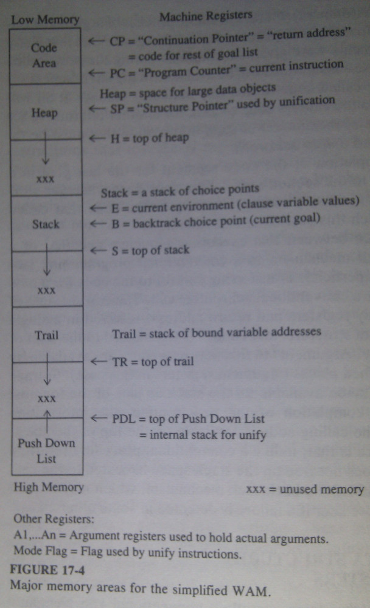

The first memory area is devoted to program code. Instructions are fetched from
this area one at a time as indicated by the ***PC register***.

Successful completion of the code section for some clause means that a goal
built by some other clause's right-hand size code has been successful, and the
machine should *return* to that point in the right-hand side and resume
execution. The ***continuation pointer*** or ***CP register*** points to this
location. Typical WAM instruction calling a procedure sets the CP to one
instruction after the call.

The next major data area is the ***heap***, which contains structures and
lists built during the unification process. These objects are usually too big
to fit into an argument register or single environment cell. The ***structure
pointer*** or ***SP register*** steps through the components of such objects
during unification. Storage here is allocated dynamically as needed, with
pointers to them left where needed. The ***H register*** indicates the top of
the allocated part of the heap.

The most important data structure is the ***stack***. It holds call/return and
environment information for sequencing through the code segments corresponding
to the clauses. The information for each attempt to solve a goal is called
***choice point***, with the ***B register*** (backtrack) pointing to the most recently
created one and the ***E register*** (environment) pointing to the one created
when the clause code currently pointed to by the PC was entered. The ***S
register*** points to the current stack top from which new choice points will
be built. 

At any point in time the PC points into the code for some clause, and
E register gives access to the current values for variables in that clause. The
B register points to the most recently created choice point and may be equal to
or greather than E. It is equal just as the code for the right-hand side is
entered and is greather as goals in that clause's body are solved successully. 

The ***trail*** is a stack of locations containing references to variables that
have received values at some point during execution (e.g. are ***bound*** or
***instantiated***), and may have to be *unbound*. ***TR register*** points to
the top of this area where new trails can be pushed. 

***PDL*** or ***push-down list*** is a small stack used by the unification
instructions to save information during unification of complex objects. ***PDL
register*** points to the top of this stack. 

## Memory Word Format ##

A cell has two parts, a ***tag*** and a ***value***. Tags are of following
types:

* ***constant***
* ***variable*** a logical variable that has not yet beed given a value by
  unification.
* ***list*** - identical to general s-expression
* ***structure*** corresponds to a syntactic term involving a function symbol
  and its arguments. It has an arity telling us how many cells are following
  (arguments)
* ***structure pointer*** indicates that the object in question is structure
  starting at designated memory location.
* ***reference*** is indirect pointer to some other cell. This is used to chain
  objects together. In many ways it behaves like ***invisible pointer*** in
  GC algorithms.

For simplicity, the notation `x#y` will denote the contents of some cell, where
`x` is tag and `y` is value. A value `*` denotes the address of that cell.
Therefore `var#*` stands for unbound variable.

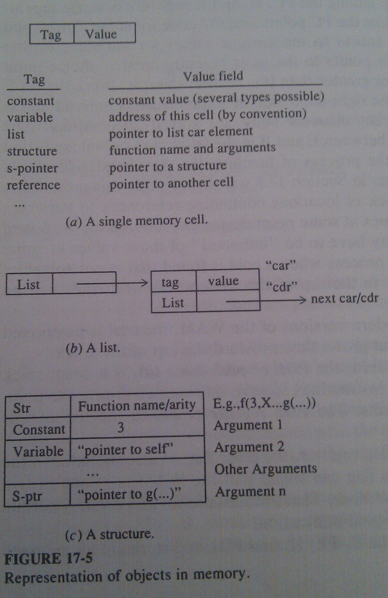

## Simplified Choice Point ##

The major data structure controlling program execution is the ***choice
point*** - a set of contiguous locations on the ain stack. They closely
resemble a ***frame***. It contains copies of the various machine registers
needed to restart clause's code under various conditions.

At any point in a program's execution there is one choice point for each goal
currently still active.

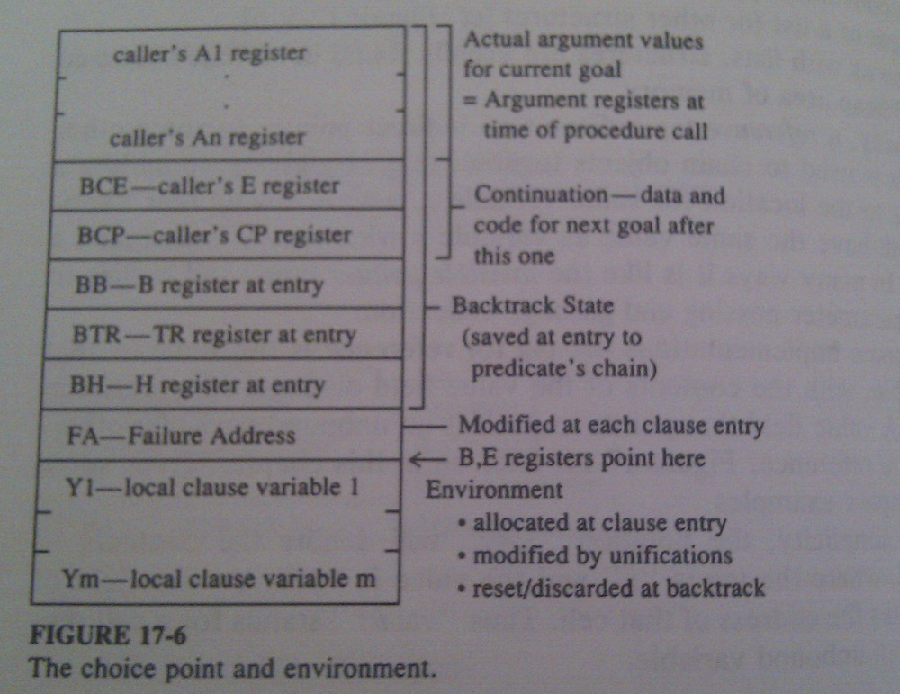

Information found includes:

* a copy of the argument registers `A1...An`. This permits the argument
  registers to be reloaded to their initial values if one clause fails after
  changing some of them and a new clause is to be tried against the same goal.
* where to return to if the goal represented by this choice point is solved
  successfully. This is called the ***continuation***, and consists of:

	* ***Backtrack Continuation Pointer or BCP*** entry. The
	instructionaddressed by this value is the beginning of the code for the
	next goal to solve in left-to-right order.
	* ***Backtrack Continuation Environment or BCE***

* The address of the code for the next clause to try if the current clause
  fails - ***FA*** (for ***failure address***). This is the primary information
  needed by the ***shallow backtrack*** process
* The state of the main memory data structures at the time the choice was
  built, namely, the top of the trail and heap, and the choice point if effect
  before this one (***BTR (backtrack trail), BH (backtrack heap), BB (backtrack
  B)***). This is primary information for ***deep backtrack*** if no clause
  exists which satisfies the current goal. 
* The ***environment*** for the values to be bound to local variables.

The notation `<entry-name>[X]` refers to the contents of a specific entry in
the choice point designated by `X` (usually `B` or `E`). Thus, `BTR[B]` is the
memory cell labeled `BTR` in the choice point selected by `B`.

## Simplified WAM Instruction Set ##

Five classes:

* ***Indexing instructions*** to control sequencing through the chain of code
  sections associated with one procedure (one head predicate symbol)
* ***Procedural instructions*** to control choice point and environment setup
  and tranfer of control from one chain to another
* ***Get instructions*** to verify that the formal arguments in a clause unify
  with current actual arguments (as recorded in the argument registers), and to
  record the appropriate unifying substitutions
* ***Put instructions*** to load the argument registers for the next goal on
  the right-hand side of some clause
* ***Unify instructions*** to handle gets and puts of complex objects such as
  lists and structures.

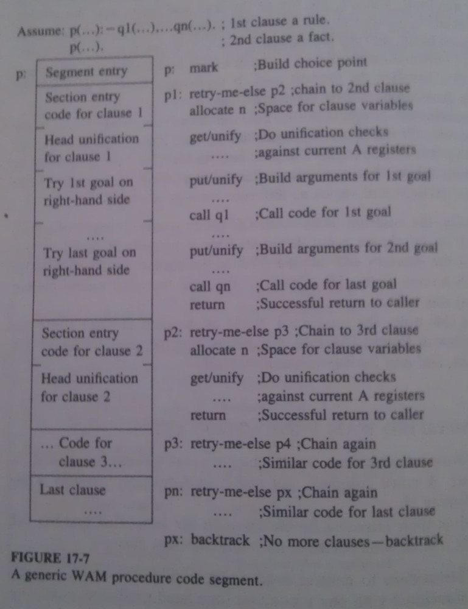

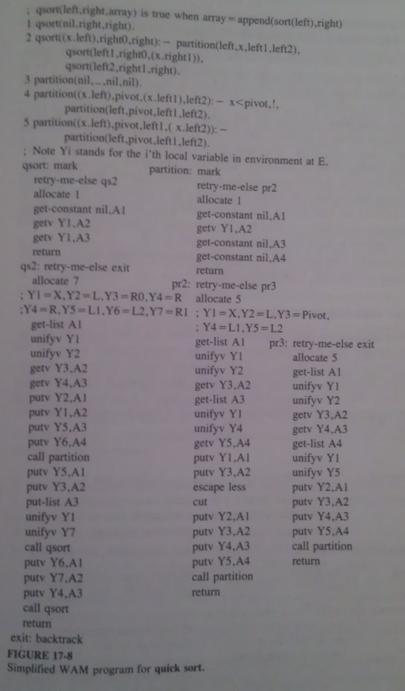

In general, the instructions described below treat the WAM machine registers in
a certain fashion:

* The B register always points to the topmost choice point on the stack
* Once inside the code for some particular clause, the E register points to the
  choice point that was created when the procedure containing that clause was
  entered. The only time this may be the same as B is just as the code for
  a particular clause is entered and before any goals on the right-hand side
  are tried.
* At the entry to the code segment for a predicate symbol, the CP register
  contains the instruction address to return to if a clause is found in the new
  procedure that unifies with the current goal, and has all of its right-hand
  side goals fully satisfiable. The E register at this time points to the
  environment needed to continue execution at CP.
* Unless otherwise specified, each instruction increments the PC register.

### Indexing Instructions ###

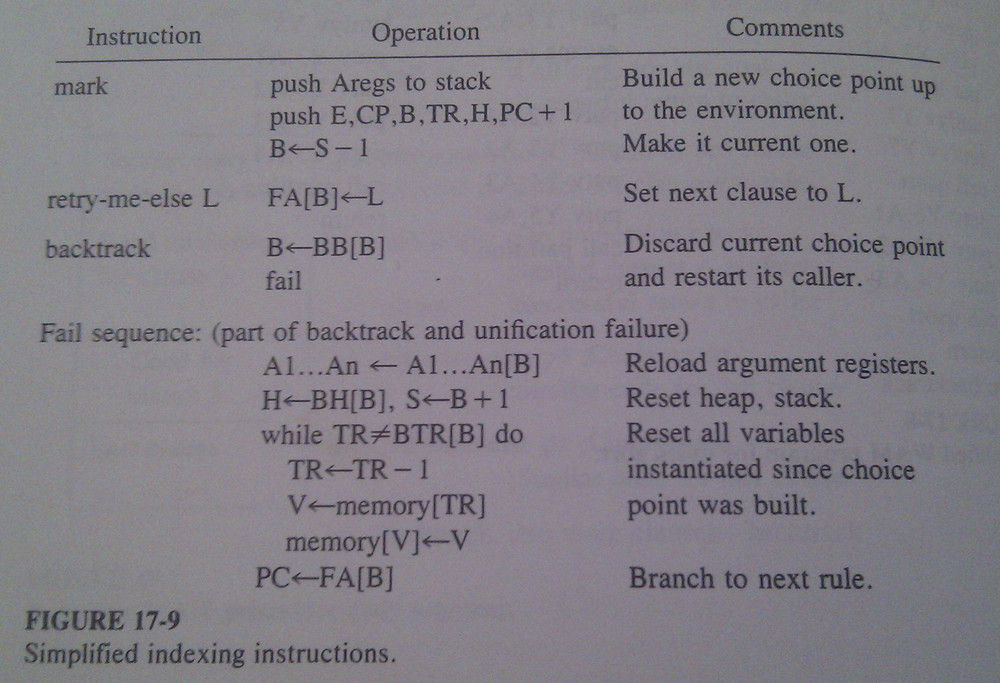

***Indexing instructions*** chain together and control the code sections for
different clauses that have the same predicate symbol in their head.

The ***mark*** instruction is the first instruction encountered in the
procedure. It builds a choice point. After execution, the B register is set to
point to the new choice point. 

The ***retry-me-else*** is the first instruction for each clause code section.
It modifies the FA entry in B's choice point to indicate the start of the code
section for the next possible clause with the same predicate symbol. This
address is provided as an argument to the instruction. The address planted by
the instruction is used if the clause corresponding to the code following it
fails for any reason. Usually the first instruction at this address is another
`retry-me-else`.

The ***backtrack*** instruction is used as the target of the retry for the last
clause of a chain. If control reaches the backtrack, then none of the clauses
satisfied current goal, and deep backtracking is necessary.

Fail sequence:

1. reload the argument registers from B's choice point
2. reset the heap top to what it was when B's choice point was built
3. use B to recompute the top of the main stack
4. ***unwind*** the trail stack by popping off the entried until the TR
   register reaches the value stored in B's choice point. For each entry popped
   off, the memory location corresponding to that variable is reset to
   a ****variable*** entry.
5 .Branch to the code specified by the FA entry in the restored choice point.
This is the next possible clause which may satisfy the goal.

### Procedural Instructions ###

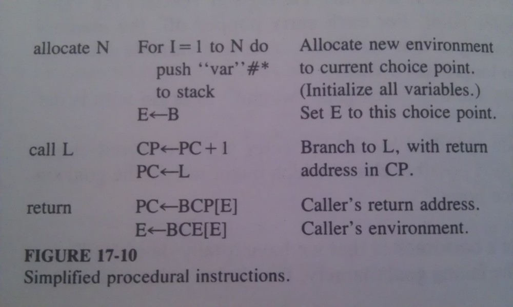

***Procedural instructions*** handle the management of environments and the
transfer of control between chains of clauses.

The ***allocate*** instruction is typically the first instruction of the code
section. and allocates space for all the clause's variables (as indicated by
its single argument). In the version shown here, this allocation is on the
stack right after the current choice point. It also initializes all N locations
in the environment to entries with tag ***variable*** and value equaling the
address of its own memory location. Also, this instruction sets up the
E register to point to the choice point where the new environment has just been
created.

The ***call*** instruction is used just after loading the argument registers
with argument values for a goal literal in the body of current clause. It saves
the address of the next instruction in the CP register and branches off to the
entry point of that clause code that corresponds to the predicate symbol in
that goal. This is identical to a subroutine call.

The ***return*** instruction is the last instruction in a clause segment, and
if executed, it indicates successful satisfaction of all goals in the body of
the clause. Control is passed back to the continuation address with the
caller's environment set, without deallocating any choice points or
environments. Unlike conventional computers, this return does not pop anything.

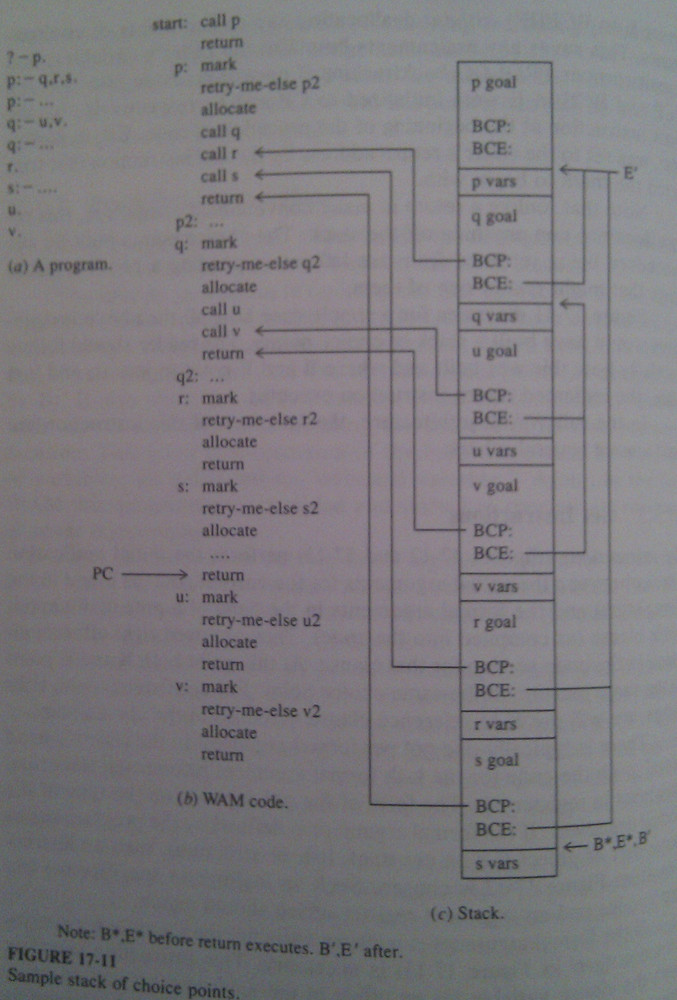

### Get Instructions ###

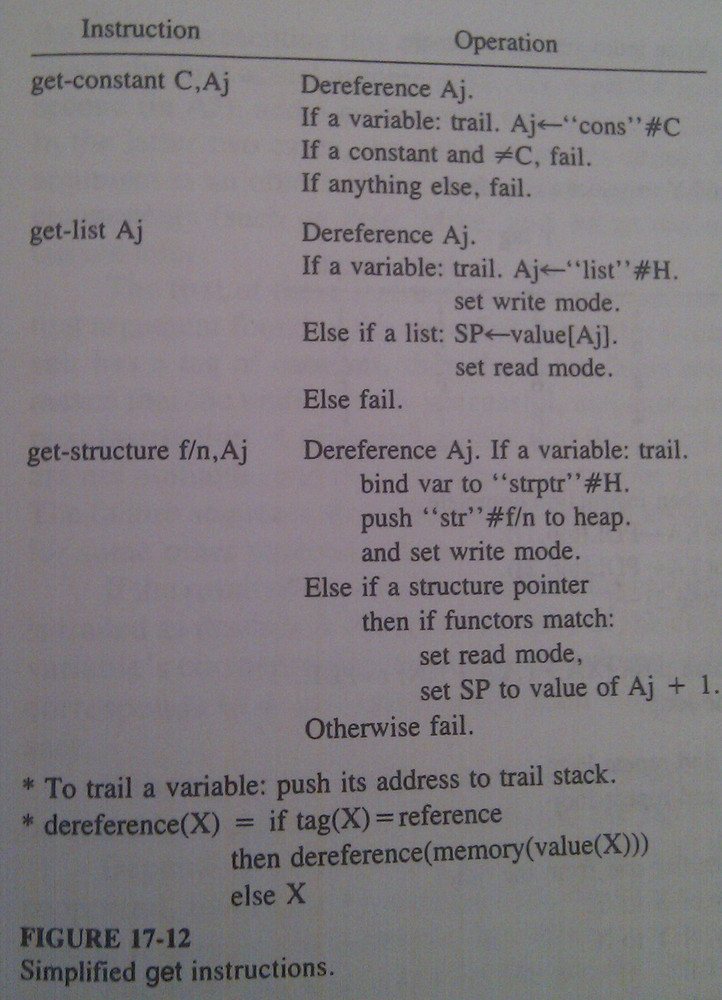

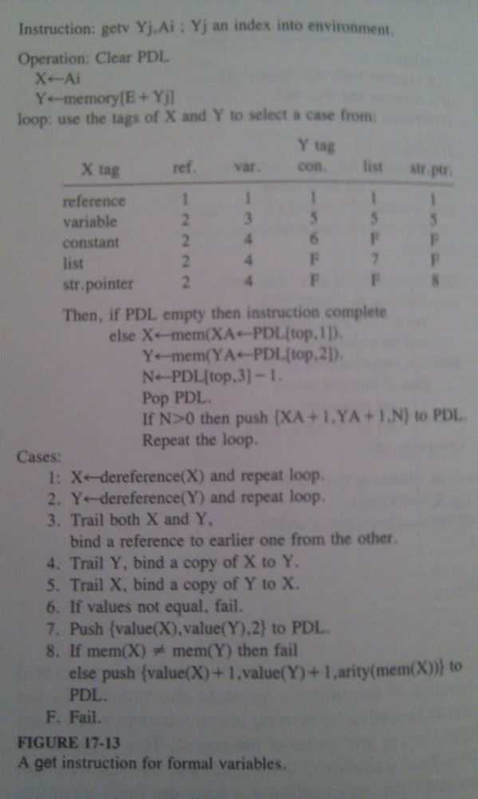

***Get instructions*** perform the initial unification checks between the
actual arguments (found in A registers) and the formal arguments in the head of
a potentially applicable clause. They are used right after an ***allocate*** in
the code section for that clause. At this point both B and E point to the same
location in the same choice point. 

There is typically one get per formal argument. The form of the get depends on
the type of the formal argument.

When a get instruction has found that some object is being matched to
a curently unbound variable, unification always works, with
a ***substitution*** generated which records the binding of the object's value
to the variable. In the WAM this substitution is recorded by writing into the
memory cell asociated with the variable the tag and value of the object. This
is fine if the rest of the head literal/goal unification goes through, but the
machine must be able to 'unwrite' the substitution if a later get finds
a contradiction.

The process of recording the information necessary to repeal the subsitution
if necessary is termed ***trailing***. It consists of pushing onto ***trail
stack*** the address of the variable being bound. To trail a variable, we
simply push a copy of its memory cell to the trail stack.

The failure of a get instruction to find a match between its argument and the
corresponding A register causes a ***shalow backtrack***. 

#### Explicit Get Instructions ####

When a programmer writes:

	P(11,(Pete.Mike),age(Pete,40)) := ...

the code representing this would use a ***get-constant*** instruction to check
the first actual argument, a ***get-list*** instruction to check the second,
adn a ***get-structure*** instruction to check the third.

***Get-constant*** takes the A register, dereference it, if the result has
a tag of ***constant***, then the value fields are compared. A match means that
the unification is successful, and execution continues. A mismatch means that
the actual and formal arguments are not unifiable and this clause cannot be
used for the current goal. The failure sequence described above is then invoked
to start up the code for some other potential clause. 

If the result of the dereference has a tag of ***variable***, then that
variable is trailed and a copy of the constant is stored into the variable's
corresponding memory cell (wiping out the ***variable*** tag). This corresponds
to a successful unification where a substitution is necessary.

***Get-list*** exprects that actual argument is list or unbound variable. If it
is a list, a later pair of unify instructions will check that the car and cdr
of the actual list match what is expected by the formal arguments. To set up
for this test, the get-list will set the ***mode flag*** status bit in the CPU
to ***read mode*** and set the SP register to  point to the memory location
containing the car of the actual goal's list.

If the tag of the actual argument is a ***variable***, then we still have
a successul unification, but we must now generate a substitution for that
variable where the variable's ew value is the formal list. In this case the
get-list sets the tag of the variable cell to ***list*** and gives the cell's
value field a copy of the current H register. The following unify instructions
will build a copy of the desired list there. In addition, this instruction sets
the ***mode flag*** to ***write mode***, telling these unify instructions to
build such list.

The ***get-structure*** is similar. After dereferencing the actual argument,
this instruction expects to see either a variable or a structure pointer. In
the latter case, the value for the functor name and arity is extracted and
compared to that stored in the instruction. A mismatch causes failure.

A match means that the actual and formal arguments have at least the same
function symbol and the same number of arguments. Following unify instructions
will check the components for matches. This is signalled by setting ***mode
flag*** to ***read mode*** and SP to point to one memory cell beyond the actual
argument's ***structure*** cell. 

An actual argument that is an unbound variable causes that variable to be
trailed and the corresponding cell overwritten by a tag of ***structure
pointer*** and a value equaling the current H register value. The cell at
memory[H] receives a tag of ***structure*** and a value equaling the functor/arity
code from the get-structure instruction. H is incremented to indicate tha
a cellhas been assigned, and the ***mode flag*** is set to ***write mode***.

#### Variable Get Instructions ####

The ***getv*** instruction handles the case where the formal argument is
a clause variable. This is complex because the compiler cannot always know
beforehand whether or not this clause variable might have a value at
a particular point, or even what kind of value that might be. 

As an example consider the case where the clause head is `p(x,x)` generating
code:

	getv 1,A1; Assume 1 is offset in environment for x
	getv 1,A2; See if first argument matches the second.

For the case where the goal is `p(2,2)`, the first getv binds 2 to x and the
second one does simple constant to constant test.

Now consider a goal of the form:

	p(g(h(3), (Pete.(a.Tim)),h(a)), g(b, (Pete.c), b))

In this goal p has two actual arguments both complex structures. The first getv
recognizes that x is unbound and binds to it a structure representing
`g(h(3),(Pete.(a.Tim)),h(a))`. The second getv must recognize that x is now
bound to a structure which does have a matching functor and whose arguments can
be unified by binding `h(3)` to `b`, `3` to `a`, and `(3.Tim)` to `c`. Further,
several of the arguments are themselves complex objects requiring checks of
their arguments.

Such process is potentially recursive, requiring some sort of internal stack to
keep track of complex objects that are not yet bound. In the WAM this is the
puprose of the ***PDL*** (or ***push-down list***). This stack is emptied at
the start of each getv, and as complex structures are found that must be
matched, a triple consisting of the starting addresses of the actual and formal
objects and the number of consecutive cells to compare is pushed onto the PDL.

### Put Instructions ###

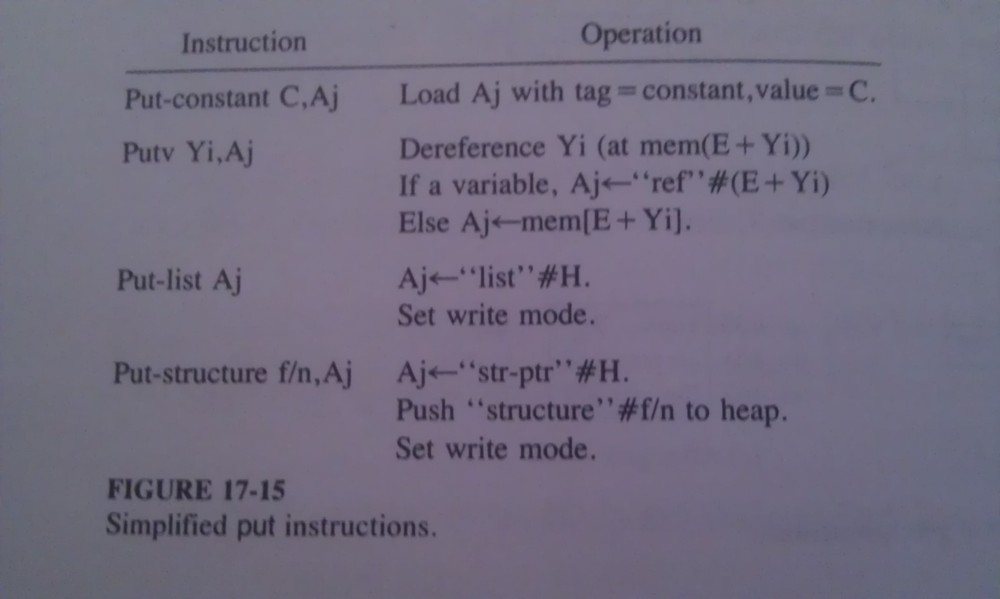

***Put instructions*** are used to load the A registers with the actual
arguments to be passed on to predicates found in the body of a clause. They
occur in bunches, one bunch per literal on the right-hand side, with one put in
each bunch for each top-level arugment in the corresponding literal. For the
most part heir operation consists of simply copying something and involves no
possibilit of a fail or backtrack. They correspond to a load register
instructions found in conventional ISAs.

For complex argument objects these instructions handle only the start of the
object. The setting of the ***mode flag*** to ***write mode*** indicates to the
unifys that objects are to be built.

### Unify Instructions ###

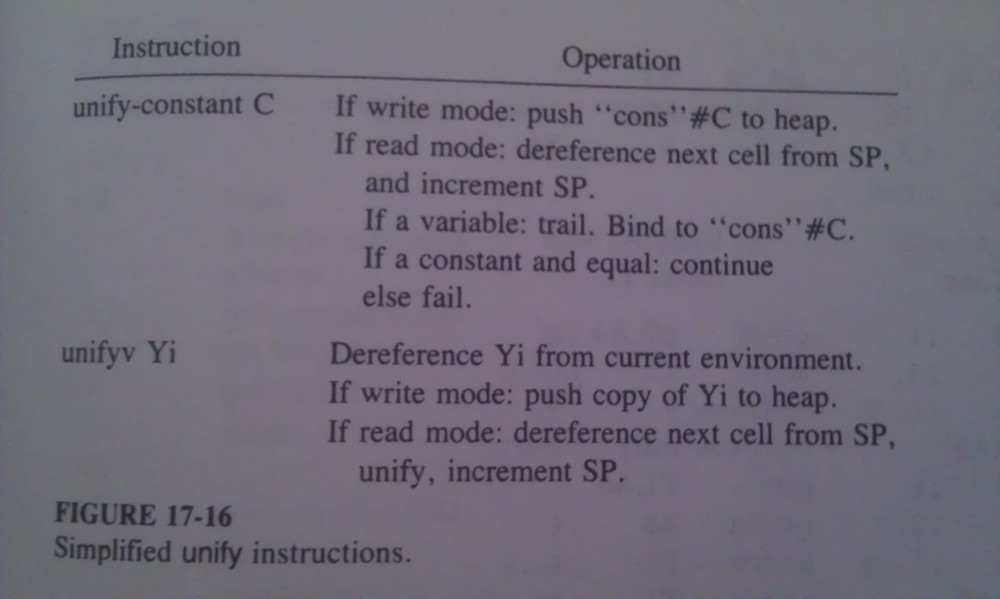

A sequence of ***Unify instructions*** are used afer get or put instructions to
handle components of lists or structures. They operate in one of two modes
signalled by the current value in the ***mode flag*** - ***read*** or
***write***. In read mode they simply attempt to unify the next component of
the object (as pointed to by the SP register) with the variable or constant
specified in the instruction. A successful match may cause variables to be
trailed and bound as in get, and increments SP to point to the next component.
Also as before, a mismatch causes a ***fail sequence*** to back the processor
up to try the next clause. Only get instructions can set the read mode.

In write mode, these instructions copy the specified constant or variable to
the object being built up on the heap. The initial get or put has earlier given
either a register or a variable a reference to the start of this object. The
SP register is not needed. Pushing on the heap increments the H register.

There are no unify-list and unify-structure instructions. A simpler approach to
handling such situations exist:

1. For each list or structure used as a component of a complex formal argument
   in the head of a clause, allocate an extra local clause variable cell not to
   be used anywhere else in the clause.
2. When the place in the code is reached where a unify-list or unify-structure
   would be used, replace it by a unifyv with an argument that specifies the
   new variable defined in step 1.
3. After completion of the top-level code for that formal argument, generate
   a putv to load some unneeded argument register with the contents of one of
   these new variables.
4. Follow this by a get-list or get-structure as appropriate against this
   argument register.
5. Use unify instructions as above to complete the components of this new
   structure.

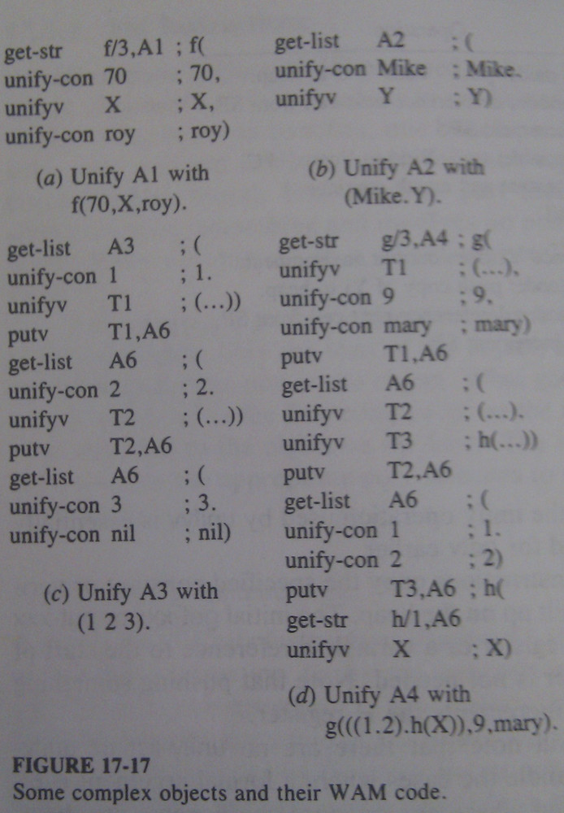

## Prolog-to-WAM Compiler Overview ##

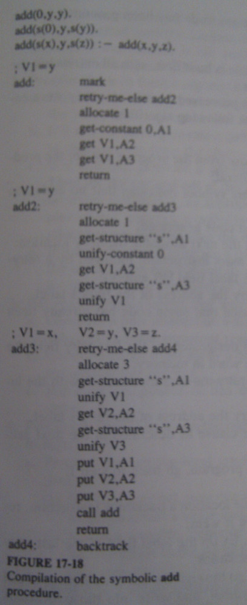

There are two major sections to this compiler. First an outer loop that cycles
through the clauses and chains them into procedures. Second is the compilation
of a single clause into a code section for the above procedure chains. 

### Procedure-Level Compilation ###

The following is a high-level description of the steps that might be involved
in cycling throuhg the clauses and linking sections of code together. It
assumes we maintain a ***symbol table*** containing an entry for each symbol
used as the predicate symbol of the head of some clause. At minimum, an entry
in this table has:

* the name of a symbol
* the memory address of the initial mark instruction for the symbol
* the memory address of the last retry-me-else instruction compiled for that
  symbol
* space for a list of places in the program where this predicate symbol has
  been referenced as a right-hand-side goal literal (where it shows up as the
  argument to a call)
* a flag indicating whether or not any code has been generated yet for the
  predicate symbol.

We assume below that this table is built first, with all entries but the first
initialized to appropriate nulls.

The program clauses are then processed in the order they were entered by the
programmer using following algorithm:

1. select the next unprocessed clause from the program and get the predicate
   symbol used in the head literal.
2. if the symbol table entry for this symbol indicates that no code has been
   generated for it yet:
	1. mark the entry as having had code generated
	2. record as the initial address the next available memory location
	3. compile into this location a mark instruction, followed by
	   a retry-me-else with the label field left empty
	4. save in the symbol table entry the address of the retry's label
3. if the symbol table entry indicated that some code has already been
   generated:
	1. store into the memory word designated by the last retry field the
	   address of the next available word in memory
	2. compile into this location a retry-me-else instruction with the label
	   left empty.
    3. save in the symbol table entry the address of the retry's label
4. generate a code section for the clause as described in next section
5. If there are more clauses in the program, go to 1
6. After compilling all clauses
	1. compile into the next available location a backtrack instruction,
	   remembering the address where it went
	2. for each symbol table entry, fix up the label field of the last retry
	   instruction to point to this backtrack
	3. for each symbol table entry, go through the list of addresses of call
	   instructions that used that symbol, adn write into those locations the
	   address of the mark instruction.
7. compile the query using a variant of the clause code generator (no head
   unification code is needed)
8. the first instruction of the query's code is the program's starting point.

### Clause-Level Compilation ###

This section assumes that a clause has been selected for compilation by the
outer compiler routine, adn that all the appropriate interclause link addresses
are set up correctly in the symbol table.

1. calculate the number of local variables needed, including allowances for
   temporaries used for complex objects buried inside other complex objects. If
   the number is not zero, generate an allocate instruction. Also build a list
   pairing local variable names and their offsets.
2. process the k-th formal argument of the head as follows (k=1,2...):
	1. if it is a constant, generate a get-constant instruction, encoding in
	   the value of the constant and Ak.
	2. if it is a variable, generate a getv instruction, encoding in the offset
	   to that variable from the above-computed pairings and Ak.
	3. if it is a list, generate a get-list instruction which references Ak.
	   Then for the car and cdr of this list generate either a unify-constant
	   or unifyv instruction, as appropriate. If either car or cdr is a complex
	   object, generate a unifyv instructionwhich refers to one of the
	   allocated temporaries.
	4. If it is a structure, generate a get-structure instruction, encoding in
	   the name of the functor and its arity. Then do exactly as described for
	   lists for each argument of this expression.
3. for each complex object that was a component of some other object:
	1. generate a putv instruction which refers to the allocated local variable
	   and to some argument register that is not needed any more.
	2. generate either a get-list or a get-structure instruction as appropriate
	   against this register.
	3. for each component of this object, generate code as was done above.
4. process the goal literals on the right-hand side one at a time, from left to
   right.
	1. process the i-th top-level argument of the next literal as follows
	   (i=1,2,...):
		1. if it is a constant, generate a put-constant instruction, encoding
		   in the constant's value and Ak.
		2. if it is a variable, generate a putv instruction, encoding in Ak and
		   the offset to the variable from the pairings developed in the first
		   step.
		3. If it is a list or a structure all of whose components are
		   either variables or constants, generate either a put-list or
		   a put-structure as appropriate (with Ak encoded), and then generate
		   a unify-constant or unifyv for each argument.
		4. if it is a list or structure that includes as embedded list or
		   structure:
			1. take the most deeply nested such component
			2. select a currently unused argument register Au
			3. generate an instruction sequence as in the prior step (put-list
			   or put-structure), but target the result to Au.
			4. generate a getv instruction to place Au in a specially allocated
			   clause variable (as was done for nested objects in the clause
			   head)
			5. repeat the above process for the next most nested component,
			   except that for components that refer to nested structures that
			   have already been processed, use a unifyv iinstruction with the
			   offset of the clause variable into which they were compoled
			   earlier.
			6. mark the register Au as free again.
	2. generate a call instruction leaving the label field empty.
	3. link the address of this field into the symbol table entry for the
	   predicate being called.
5. complete the code by generating a return instruction

Note that the processing order for complex objects as they are built for
right-hand side  goals is just the opposite of that for head unification,
namely, inside out versus outside in. they do, however, use the same ide of
temporarily saving a partially processed object in an extra clause variable
until it is needed. Note also that one of the final steps in the outer loop
uses information from the symbol table to fix up all the labels for the call
instructions to point to the correct procedure entry points. 

## Supporting Built-ins ##

The WAM as described supports pure Prolog, without special built-in predicates
that have side effects, such sa cut, I/O, ad the various predicates to read and
modify the program dynamically.

### Some Simple New Instructions ###

***Fail*** invoked the failure sequence.

***Escape*** permits a WAM machine to communicate with some other processor
(perhaps one that is capable of arithmetic functions, IO...). The instruction
simply takes the current argument registers, places theme somewhere the other
processor can access them, signals the other processor and waits for
a completion.

***Switch-on-type*** specifies an argument register and four addresses to
branch to. The argument is dereferenced and the tag is tested. Depending on the
tag one of the four branch addresses are placed in the PC.

To understand ***cut*** consider a clause of the form:

	p(...) := q1(...),...qn(...),!,r1(...),...,rm(...).

When converted into WAM cde, the code to support the cut operation should come
immediately after the call qn instruction. Following this code should then be
the normal puts in support of r1. 

If the program execution ever reaches the cut code, B points to the most recent
choice point build in support of qn, while E points to the earlier one
established for p. The semantics of a cut dictate that any backtracks through
it will always succeed, but will have the effect that any backtracks through it
should result in a backtrack through the p choice point. It should be as if the
choice points for q1 to qn never existed, and that this clause is the last one
possible for the p predicate. 

One way to do this is to have the cut code set B to poin to the same choice
point as E does, and to load FA[E] with the address of some location known to
hold a backtrack instruction. Now if the code for r1 backtracks, it will
restart p's choice point, which will branch to a backtract instruction, which
in turn will restart the prior choice point as desired.

### Multiiinstruction Build-ins ###

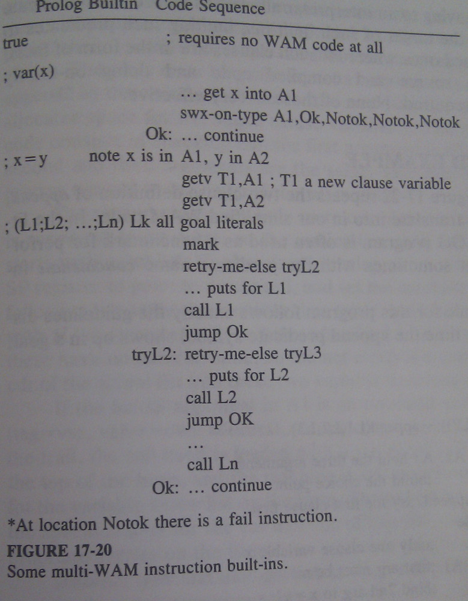

***Disjunction*** `;` is worth discussion. What it does is build a separate
choice point for the goals involved that will try the second if the first does
not succeed, and so on. 

### Tough Predicates ###

Some of the Prolog built-in predicates represent a very tough challenge to
implementation with WAM code. These include the predicates that read and
modify the set of Prolog statements during the execution, such as ***clause,
assert, retract***.

## Detailed Example ##

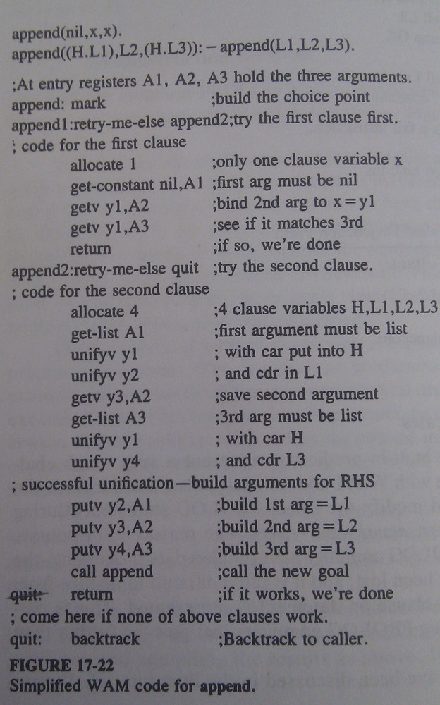

Any time the append predicate symbol shows up in a goal, control is transferred
to the first instruction, the mark, with three arguments in argument registers
A1, A2, A3. This instruction builds the initial choice point and drops down to
the entry append1 for the first clause. The entry code here consists of
a retry-me-else which designated append2 as the starting location for the next
possible rule for append and allocates space for the single clause variable x.
The body of the clause code consists of checking that the first argument is
nil, and then that the second and third arguments are the same. The final
instruction, return, returns control to the caller if this all worked. 

The second clause is a little more complex. Here the first argument is
supposed to be a list, so the unification code for the first argument starts
with a get-list. If A1 is a list, this will set the SP register to poin to its
car cell, and set the machine to rad mode. The following two unifyv
instructions then try to unify the car of the actual list with H, and the cdr
with L1. Both of these have no current value, so the net effect is a copying of
the car and cdr of the actual list into these two variable locations in th
environment. 

If the actual argument in A1 is an unbound variable to begin with, a copy of
the variable's cell is pushed to the trail, the cell itself is loaded with
a tag of list and a value pointing to the top of the heap, and the machine is
set to write mode. We will build for the variable a new list on the heap. The
two unifyv instructions handle the specifications for the car and cdr of this
list, and will create the appropriate entries on the heap.

Another getv and then get-list, unifyv, unifyv combination follows to process
the other two arguments.

Following this code, three putvs create the new argument values needed to call
append from the body. Note that copies of the original A registers are in the
choice point where they get reloaded if a backtrack occurs. 

The recursive call to append repeats this whole process over again with the new
arguments.

Upon a successful return from one call, the return instruction will
successfully return from either code sequence.

The final instruction is a backtrack, and is positioned as a new clause if the
second one fails. This signals that there are no more rules for this goan and
deep backtrack must occur. 

## Problems ##

1. Convert the set of Prolog statements for each of the following predicate
   symbols as found in the text into a sequence of simplified WAM instructions:
   1. member(x,y) [use z in place of the anonymous variable]

			#set membership
			member(x,(x._)). 
			member(x,(_.y)) :- member(x,y)

		Solution:

			;at entry registers A1, A2 hold two arguments
			member:  mark
			member1: retry-me-else member2
					 allocate 3
					 getv y1, A1
					 get-list A2
					 unifyv y2
					 unifyv y3
					 getv y1, y2
					 return
			member2: retry-me-else quit
					 allocate 3
					 getv y1, A1
					 get-list A2
					 unifyv y2
					 unifyv y3
					 putv y1, A1
					 putv y3, A2
					 call member
					 return
			quit:    backtrack

   2. reverse(x,y)

			#second argument is reversed list
			reverse(x,y) :- rev(x,(),y). 
			rev(nil,y,y).
			rev((h.t),y,z) :- rev(t,(h.y),z)

		Solution:

			reverse:  mark
			reverse1: retry-me-else quit
					  allocate 2
					  getv y1, A1
					  getv y2, A2
					  putv y2, A3
					  put-constant nil, A2
					  call rev
					  return
			quit:	  backtrack

			rev:	  mark
			rev1:	  retry-me-else rev2
					  allocate 1
					  get-constant nil, A1
					  getv y1, A2
					  getv y1, A3
					  return
			rev2:     retry-me-else quit2
					  allocate 4
					  get-list A1
					  unifyv y1
					  unifyv y2
					  getv y3, A2
					  getv y4, A3
					  putv y2, A1
					  put-list A2
					  unifyv y1
					  unifyv y3
					  putv y4, A3
					  call rev
					  return
			quit2:    backtrack

